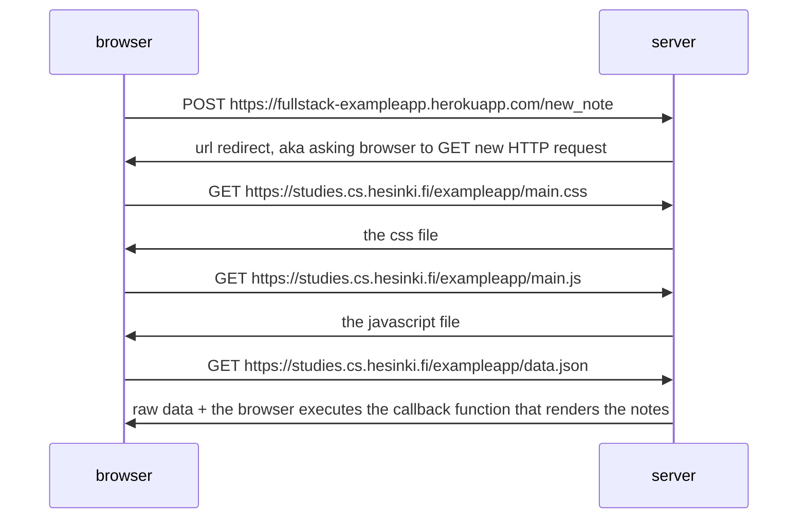

```mermaid
sequenceDiagram
participant browser
participant server
browser ->> server: POST https://fullstack-exampleapp.herokuapp.com/new_note
server ->> browser: url redirect, aka asking browser to GET new HTTP request
browser ->> server: GET https://studies.cs.hesinki.fi/exampleapp/main.css
server ->> browser: the css file
browser ->> server: GET https://studies.cs.hesinki.fi/exampleapp/main.js
server ->> browser: the javascript file
browser ->> server: GET https://studies.cs.hesinki.fi/exampleapp/data.json
server ->> browser: raw data + the browser executes the callback function that renders the notes

```
