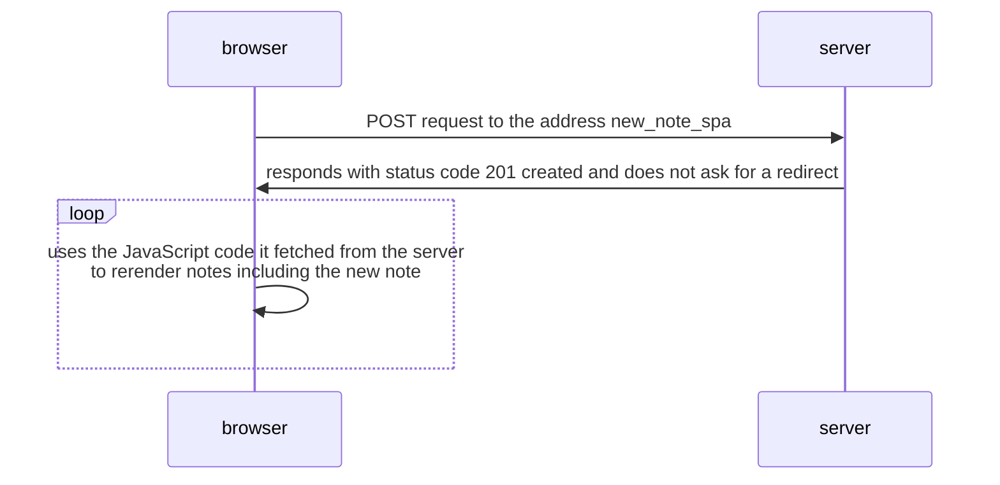

```mermaid
sequenceDiagram
browser->>server: POST request to the address new_note_spa
server->>browser: responds with status code 201 created and does not ask for a redirect
loop 
    browser->>browser: uses the JavaScript code it fetched from the server <br> to rerender notes including the new note
end
```
